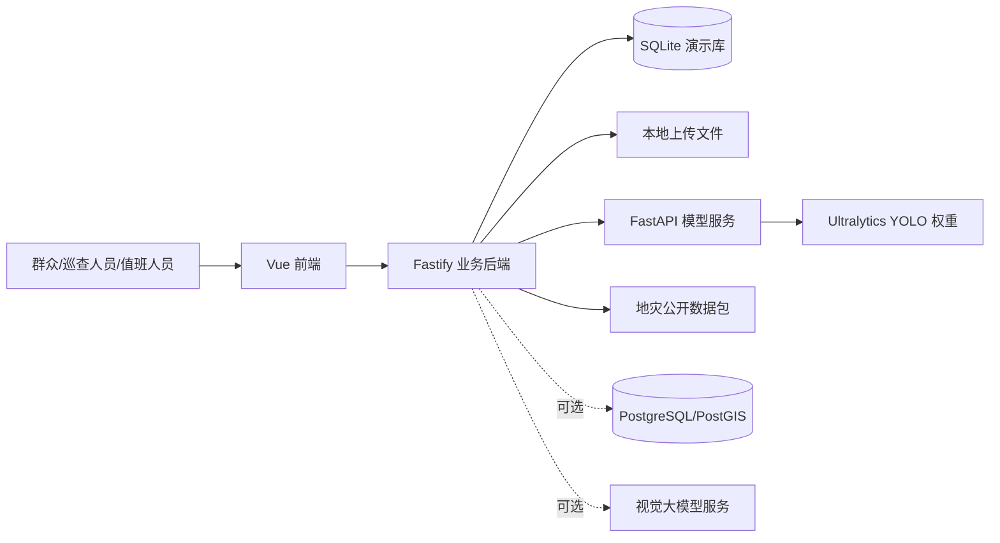
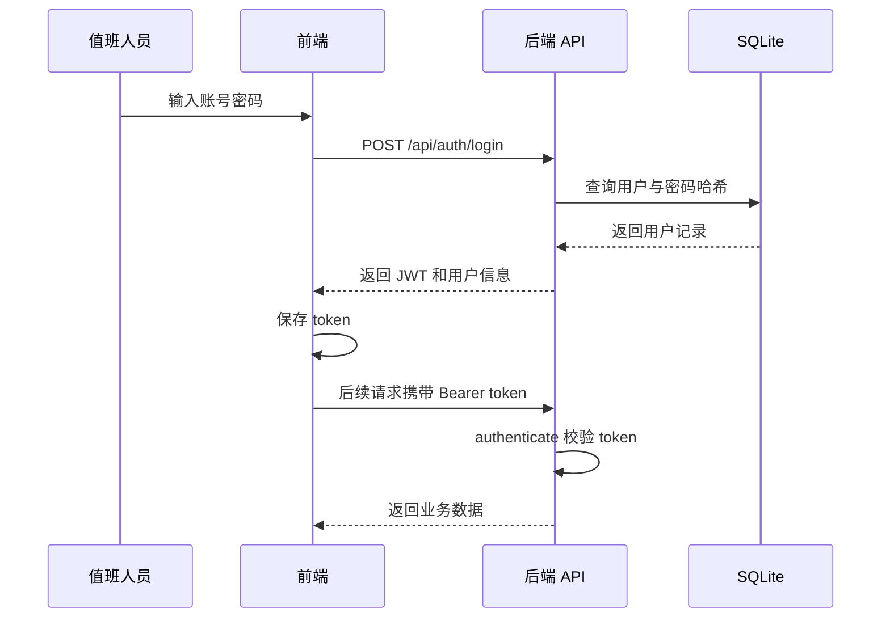
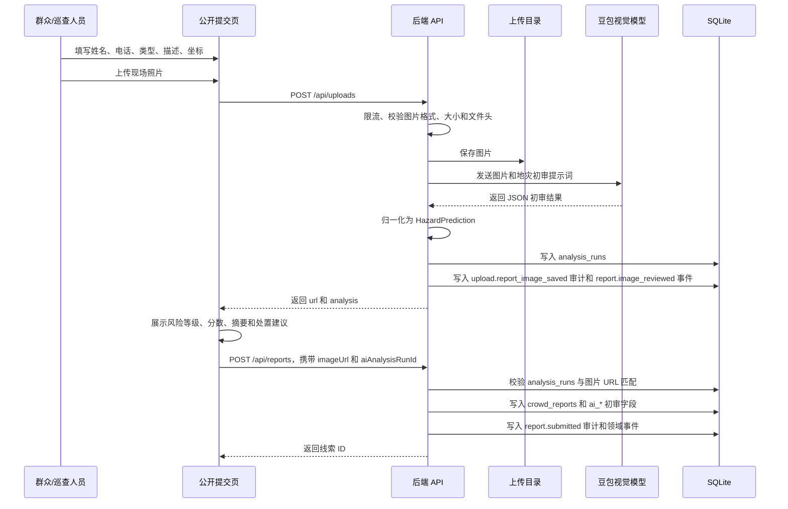
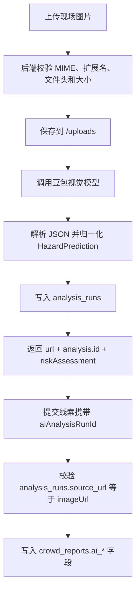
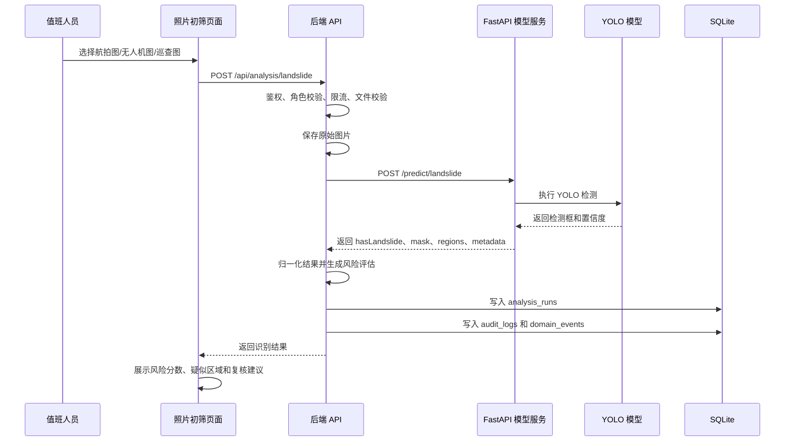
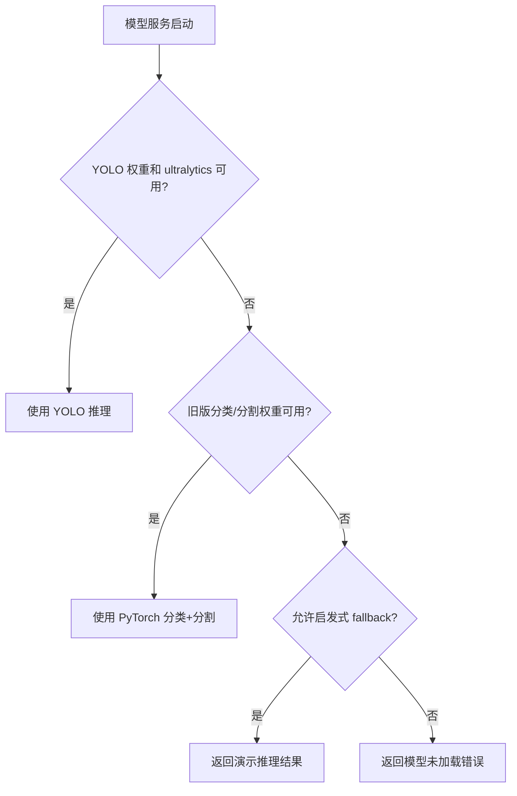

# GeoProphet 平台原理与工作流说明

生成日期：2026-06-07

## 1. 平台定位

GeoProphet 是一个面向地质灾害场景的群众线索补充与图像初筛平台。当前版本的核心定位不是替代政府已有地灾监测系统，也不是完整重建地灾数据中心，而是围绕“群众发现线索、现场照片举证、AI 快速初筛、后台值班复核”形成轻量闭环。

平台适合用于：

- 群众或巡查人员提交滑坡、泥石流、崩塌、沉陷、裂缝等现场线索。
- 值班人员查看待复核线索、照片、位置、描述和提交趋势。
- 对航拍图、无人机照片、现场巡查图进行疑似滑坡初筛。
- 保存识别结果、风险分数、疑似区域、模型来源和处置建议，方便后续复核留痕。
- 作为后续接入真实监测系统、空间数据主库和生产模型服务的业务底座。

一句话概括：GeoProphet 把“人看到的现场异常”和“模型看到的图像疑点”统一收进一个可复核、可追踪、可扩展的地灾线索平台。

## 2. 总体架构原理

平台采用前端、业务后端、模型服务和数据层分离的架构。



### 2.1 前端展示层

前端位于 `frontend/`，使用 Vue 3、Vite、Element Plus、Pinia 和 Vue Router。当前主要页面包括：

- `/login`：账号登录。
- `/submit`：公开线索提交页，免登录提交现场照片、坐标和描述；带图线索会先完成豆包图片初审。
- `/`：线索总览，展示待复核线索、预警统计、趋势和近期动态。
- `/reports`：群众举证后台，供值班人员查看、补充上报线索，并查看豆包初审风险。
- `/landslide-detection`：航拍图像滑坡初筛工作台。

前端只调用业务后端 API，不直接访问模型服务。这样可以让鉴权、上传校验、审计、结果入库和模型供应商切换都集中在后端处理。

### 2.2 业务后端层

后端位于 `backend/`，使用 Fastify + TypeScript。它负责平台的业务规则和接口编排，主要能力包括：

- 用户登录、JWT 鉴权和角色权限控制。
- 群众上报、图片上传、文件类型校验和限流。
- 航拍/巡查图像初筛任务提交。
- 模型服务 HTTP 转发、超时控制、结果归一化和入库。
- 线索总览、监测点、预警、系统日志、审计日志和领域事件记录。
- 地灾公开数据包读取、GeoJSON 图层输出、PostGIS 可选读取。
- 健康检查，包含数据库和模型服务状态。

后端是平台的“调度中枢”。它不把模型逻辑写死在业务代码里，而是通过 `AI_INFERENCE_BASE_URL` 调用独立模型服务。

### 2.3 模型服务层

模型服务位于 `model-service/`，使用 FastAPI + PyTorch + Ultralytics。当前滑坡识别接口是：

- `GET /health`
- `POST /predict/landslide`

模型服务的加载顺序是：

1. 优先加载 `LANDSLIDE_YOLO_PATH` 指向的 YOLO 权重，默认目标路径为 `models/yolo_landslide_from_masks/yolov8n_640/weights/best.pt`。
2. 如果 YOLO 不可用，尝试加载旧版 PyTorch 分类器和分割器。
3. 如果正式权重均不可用，且 `ALLOW_HEURISTIC_FALLBACK=true`，则使用启发式 fallback 生成演示结果。
4. 如果生产环境未加载模型且禁止 fallback，则识别接口返回错误。

YOLO 推理输出检测框，模型服务会将检测框转换为平台统一结构：是否疑似滑坡、置信度、疑似区域 polygon、mask、摘要和 metadata。

### 2.4 数据层

当前业务数据默认存储在 SQLite 演示库中，初始化脚本为 `backend/db/init.sql`。核心表包括：

- `users`：用户账号。
- `sites`：监测点或隐患点。
- `sensors`、`observations`：传感器与观测数据。
- `alerts`：预警记录。
- `crowd_reports`：群众上报线索。
- `analysis_models`：模型资产展示。
- `analysis_runs`：图像识别任务结果。
- `system_logs`：系统动态。
- `audit_logs`：审计日志。
- `domain_events`：领域事件。

空间和遥感数据主要位于 `data/geohazards/`。后端支持从本地 CSV、GeoJSON、GeoTIFF 元数据读取，也预留 PostgreSQL/PostGIS 作为空间主库。

## 3. 核心原理

### 3.1 线索补充原理

传统地灾监测依赖专业传感器、巡查队伍和政府业务系统。GeoProphet 的补充价值在于把群众和巡查人员看到的现场异常结构化收集起来。

一条线索由以下信息组成：

- 上报人和联系电话。
- 线索标题、类型和现场描述。
- 经纬度位置。
- 现场照片。
- 后台生成或传入的可信度分数。
- 如果包含照片，还会绑定豆包图片初审记录 `ai_analysis_run_id`，并保存模型供应商、模型名称、风险等级、摘要、处置建议和是否需要复核。
- 处理状态，例如 `pending`、`reviewing`、`verified`。

这些信息写入 `crowd_reports`，并同步记录审计日志和领域事件。这样后续可以扩展通知、派单、复核、归档等流程。

### 3.2 图像初筛原理

图像初筛的目标不是直接发布正式预警，而是帮助值班人员快速发现“值得看一眼”的照片。

当前主链路是 YOLO 初筛：

1. 用户上传航拍图、无人机照片或现场巡查图片。
2. 后端校验文件类型、大小、扩展名和图片头。
3. 后端保存原图到上传目录。
4. 后端将图片以 multipart 方式转发到 FastAPI 模型服务。
5. 模型服务使用 YOLO 检测疑似滑坡区域。
6. 后端把模型返回结果归一化为平台统一结构。
7. 后端计算或整理风险评估字段。
8. 结果写入 `analysis_runs`。
9. 前端展示风险等级、置信度、疑似区域叠加、多条判定依据和处置建议。

平台的统一结果结构包含：

- `classification`：是否存在疑似地灾、类别、置信度。
- `segmentation.regions`：疑似区域 polygon，坐标为 0 到 1 的相对比例。
- `riskAssessment`：风险等级、风险分数、判定依据、是否需要复核、处置建议。
- `metadata`：模型来源、阈值、检测数量、输入模式等。

### 3.3 风险评估原理

后端不会只把模型置信度原样展示，而是结合以下因素形成 `riskAssessment`：

- 是否检出疑似地灾。
- 模型置信度。
- 疑似区域数量和区域分数。
- 模型或视觉服务返回的可见证据。
- 是否由外部服务显式给出风险等级和风险分数。

风险等级分为：

- `low`：低风险。
- `medium`：中风险。
- `high`：高风险。
- `critical`：极高风险。

风险结果用于辅助复核，不等同于正式预警发布。正式预警仍应由专业人员结合降雨、地形、历史隐患点、现场核查和政府业务规则确认。

### 3.4 可选视觉大模型原理

后端支持两类视觉大模型入口：

- `/api/uploads`：公开群众上报和后台代录使用。它会先保存现场照片，再调用豆包做图片初审，最后返回图片 URL 和 `analysis` 结果。带图线索必须携带这个 `analysis.id` 提交，后端会校验图片地址和模型记录是否匹配。
- `/api/analysis/mobile-image`：登录后的可选视觉大模型识别接口，可由移动巡查或智能研判工作台挂载。它用于巡查照片识别，结果同样写入 `analysis_runs`，但不自动绑定群众线索。

视觉大模型链路通过 `VISION_PROVIDER`、`VISION_API_KEY`、`VISION_BASE_URL`、`VISION_MODEL` 等环境变量启用。群众上报图片初审当前要求 `VISION_PROVIDER=doubao`，否则上传接口会返回配置错误。

视觉大模型链路的特点是：

- 适合对现场照片做语义判断，例如裂缝、落石、坡体裸露、道路受阻等可见线索。
- 要求模型返回严格 JSON。
- 后端解析 JSON 后仍转换为统一的 `HazardPrediction` 结构。
- 结果统一落入 `analysis_runs.result_json`，其中包含 `riskAssessment`、`classification`、`segmentation` 和 `metadata`。
- DeepSeek 官方 API 当前在代码中被标记为不提供稳定图片输入能力，因此会提示改用豆包或 OpenAI-compatible 视觉模型。

这条链路是辅助能力，不替代 YOLO 航拍图像初筛主链路。

### 3.5 审计与事件原理

平台对关键动作记录两类留痕：

- 审计日志 `audit_logs`：记录谁在什么时候做了什么，涉及哪个实体，请求 ID、IP、User-Agent 和元数据是什么。
- 领域事件 `domain_events`：记录业务事件，例如 `report.submitted`、`analysis.completed`，方便以后接通知、消息队列、工单或大屏推送。

这使当前 MVP 虽然轻量，但已经具备从“页面演示”走向“可追踪业务系统”的基础。

## 4. 端到端工作流

### 4.1 登录与后台访问工作流



登录成功后，前端路由守卫会在访问受保护页面前校验 token。如果 token 失效，用户会回到登录页。

### 4.2 公开群众上报工作流

公开页 `/submit` 面向群众或巡查人员，免登录使用。当前规则是：如果提交现场照片，必须先完成豆包图片初审；前端拿到 `analysis.id` 后，才能把线索正式提交到 `crowd_reports`。



这个流程免登录，适合公开入口。为了防止滥用，后端对公开提交和上传接口设置了限流。若视觉模型未配置、豆包调用失败或返回结构无法解析，图片上传会失败，前端不会允许提交一条“有图片但没有初审记录”的线索。

无图线索仍可直接提交。此时 `imageUrl` 和 `aiAnalysisRunId` 为空，后端会把线索写入 `crowd_reports`，可信度使用提交值或演示兜底值。

### 4.3 后台群众举证工作流

后台值班人员进入 `/reports` 后，前端请求 `GET /api/reports`。后端从 `crowd_reports` 读取线索列表，关联监测点名称，并返回已绑定的豆包初审字段。值班人员可以查看：

- 上报时间。
- 线索类型。
- 上报位置。
- 现场描述。
- 图片证据。
- 豆包风险等级和风险标签。
- 豆包摘要、处置建议和是否需要复核。
- 当前状态。
- 可信度分数。

后台代录使用同一个 `/api/uploads` 和 `/api/reports` 链路。值班人员替群众补录时，选择图片会触发“保存图片 + 豆包初审”；提交表单时携带 `aiAnalysisRunId`，后端再次校验图片地址和初审记录一致，避免前端伪造或错绑。

当前版本主要完成展示、补录、初审绑定和留痕，后续可以扩展为“复核、驳回、转预警、生成工单、归档”的完整处置流程。

### 4.4 豆包图片初审绑定工作流

豆包初审不是一条孤立的模型调用，而是群众线索入库前的质控步骤。



写入 `crowd_reports` 的 AI 字段包括：

- `ai_analysis_run_id`：对应的 `analysis_runs.id`。
- `ai_provider`：当前群众图片初审固定为 `doubao`。
- `ai_model_name`：实际调用的视觉模型 ID。
- `ai_risk_level`、`ai_risk_label`：风险等级和中文标签。
- `ai_summary`：模型摘要。
- `ai_recommended_action`：处置建议。
- `ai_review_required`：是否建议人工优先复核。

这组字段让后台队列不必再次解析完整 `result_json`，也能快速筛选高风险线索；完整模型输出仍保存在 `analysis_runs.result_json` 中。

### 4.5 航拍图像 YOLO 初筛工作流



前端会在原图上叠加 polygon，帮助值班人员快速定位疑似区域。结果也会显示在“初筛记录”中，方便回溯。

### 4.6 模型服务降级工作流

模型服务启动时会检查权重和依赖。



在 demo 环境中，fallback 可以保证接口联调不断链；在 production 环境中，后端配置要求必须提供 `AI_INFERENCE_BASE_URL`，并禁止用 mock 结果冒充正式识别。

### 4.7 总览工作流

线索总览页面通过 `GET /api/dashboard/overview` 获取聚合数据。后端从 SQLite 中统计：

- 监测点数量。
- 在线传感器数量。
- 活动预警数量。
- 待审核群众上报数量。
- 风险等级分布。
- 预警等级分布。
- 预警和上报趋势。
- 地图点位。
- 最新预警和系统动态。

这个页面的作用是让值班人员先看到“哪里有新线索、哪里有活动预警、哪些内容需要复核”。

### 4.8 地灾数据和遥感支撑工作流

虽然当前主页面聚焦线索补充和照片初筛，后端仍保留地灾数据支撑能力：

- `GET /api/geohazards/overview`：读取地灾数据包概览。
- `GET /api/geohazards/layers/:layerId`：输出指定 GeoJSON 图层。
- `GET /api/geohazards/remote-sensing/status`：查看遥感同步状态。
- `POST /api/geohazards/remote-sensing/sync`：触发遥感资产同步。

数据来源包括 NASA/USGS 等公开数据包、本地 `data/geohazards/` 文件，以及可选 PostGIS。该能力可以在后续版本中重新进入前端数据中心或地图图层页面，用于与群众线索和 AI 初筛结果做空间叠加。

## 5. 关键接口清单

### 5.1 认证

- `GET /api/auth/providers`
- `POST /api/auth/login`
- `GET /api/auth/me`

### 5.2 总览与系统

- `GET /api/health`
- `GET /api/dashboard/overview`
- `GET /api/system/logs`
- `GET /api/system/audit-logs`
- `GET /api/system/domain-events`
- `GET /api/docs`
- `GET /api/requirements`

### 5.3 群众上报

- `GET /api/reports`：登录后查看群众线索列表，包含 `aiAnalysisRunId`、豆包风险等级、摘要、处置建议和是否需要复核。
- `POST /api/reports`：提交群众线索。无图线索可直接提交；带图线索必须携带 `imageUrl` 和匹配的 `aiAnalysisRunId`。
- `POST /api/uploads`：公开入口和后台代录共用的图片上传接口。它会校验图片、保存文件、调用豆包视觉模型、写入 `analysis_runs`，并返回 `{ url, analysis }`。

### 5.4 图像初筛

- `GET /api/analysis/models`
- `GET /api/analysis/assessments`
- `GET /api/analysis/runs`
- `POST /api/analysis/landslide`：登录后的 YOLO / 模型服务图片初筛入口，适合航拍图、无人机图和巡查图。
- `POST /api/analysis/mobile-image`：登录后的可选视觉大模型图片识别接口，结果写入 `analysis_runs`，但不自动绑定群众线索。

### 5.5 模型服务

- `GET /health`
- `POST /predict/landslide`

### 5.6 地灾数据支撑

- `GET /api/geohazards/overview`
- `GET /api/geohazards/layers/:layerId`
- `GET /api/geohazards/remote-sensing/status`
- `POST /api/geohazards/remote-sensing/sync`

## 6. 运行和部署工作流

### 6.1 本地开发

根目录通过 npm workspace 管理前端和后端：

```bash
npm install
npm run dev
```

常用地址：

- 前端开发地址：`http://localhost:5173`
- 后端 API：`http://localhost:3000`
- API 文档：`http://localhost:3000/api/docs`
- 公开提交页：`http://localhost:5173/submit`

如果需要连通真实或容器内模型服务，可以启动 Docker Compose 中的 `model-service`。

### 6.2 Docker 组合部署

`docker-compose.yml` 定义了三个服务：

- `web`：Nginx 托管前端静态文件。
- `api`：Fastify 后端。
- `model-service`：FastAPI/YOLO 模型服务。

运行命令：

```bash
docker compose up --build
```

默认访问：

- 前端：`http://localhost:8080`
- 后端：`http://localhost:3000`
- 模型服务：`http://localhost:8000`

### 6.3 关键环境变量

- `APP_MODE`：`demo` 或 `production`。
- `JWT_SECRET`：JWT 签名密钥，生产环境必须足够长且不能使用演示值。
- `CORS_ORIGINS`：生产环境跨域白名单。
- `AI_INFERENCE_BASE_URL`：模型服务地址。
- `AI_LANDSLIDE_ENDPOINT`：滑坡识别接口路径，默认 `/predict/landslide`。
- `LANDSLIDE_YOLO_PATH`：YOLO 权重路径。
- `ALLOW_HEURISTIC_FALLBACK`：模型服务是否允许启发式演示降级。
- `VISION_PROVIDER`、`VISION_API_KEY`、`VISION_BASE_URL`、`VISION_CHAT_ENDPOINT`、`VISION_MODEL`、`VISION_TIMEOUT_MS`：视觉大模型配置；群众图片初审要求 `VISION_PROVIDER=doubao`。
- `POSTGIS_DATABASE_URL`：可选 PostGIS 连接。
- `GEOHAZARDS_DATA_DIR`：地灾数据包目录。

## 7. 平台边界和注意事项

1. AI 初筛不是正式预警。

   YOLO 或视觉大模型输出只能作为值班复核参考，不能直接替代专家研判、现场踏勘和政府预警发布流程。

2. 当前主业务闭环偏轻量。

   平台已经覆盖上报、上传、初筛、展示和留痕，但工单派发、复核状态流转、通知、应急响应和归档复盘仍需继续建设。

3. SQLite 适合演示，不适合作为生产主库。

   正式生产建议迁移 PostgreSQL/PostGIS，并完善备份、权限、迁移和空间索引。

4. 模型效果依赖训练数据和部署权重。

   如果 YOLO 权重不存在，系统可能走 fallback。演示时应说明当前模型来源、权重路径、是否为真实推理，以及结果置信边界。

5. 公开提交入口需要治理。

   当前已有基础限流和图片校验，生产还应加入更细的反垃圾、内容安全、图片重编码、对象存储隔离和隐私合规策略。

6. OIDC 目前是预留能力。

   登录提供方接口和界面已有占位，但真实统一身份认证仍需补完整授权码流程、回调处理和用户映射。

## 8. 总结

GeoProphet 当前的核心原理是：用前端收集和展示地灾线索，用 Fastify 后端统一完成鉴权、上传、业务入库、审计和模型编排，用豆包视觉模型完成群众照片入库前初审，用 FastAPI 模型服务承载 YOLO 滑坡图像初筛，再把结果转成可复核的风险评估记录。

它的主工作流可以概括为：

```text
群众/巡查人员提交现场线索
        ↓
平台保存照片、位置、描述和联系人
        ↓
带图线索先调用豆包图片初审
        ↓
初审结果写入 analysis_runs，并把 analysis.id 返回前端
        ↓
提交线索时绑定 aiAnalysisRunId，写入 crowd_reports.ai_* 字段
        ↓
值班人员在后台查看待复核队列
        ↓
对航拍图或巡查图执行 YOLO 初筛
        ↓
系统输出疑似区域、置信度、风险等级和处置建议
        ↓
结果进入 crowd_reports、analysis_runs、audit_logs、domain_events 留痕
        ↓
人工复核后再进入预警、派单或归档流程
```

因此，GeoProphet 更准确的产品表述是“地灾群众线索补充与 AI 图像初筛平台”。它已经具备演示和联调闭环，也为后续接入真实监测数据、PostGIS 空间库、生产模型、工单流转和应急处置系统留下了清晰扩展口。
